# 股票量化平台数据库 ER 图说明书

## 1. 文档说明

### 1.1 文档目标

本文档用于在实施版文档的基础上，进一步明确股票量化平台的核心数据实体、实体关系、主外键关系、状态约束、索引建议和分域边界，作为数据库详细设计和 ER 图评审依据。

### 1.2 关联文档

- `docs/quant_implementation_spec.md`
- `docs/quant_requirements_design.md`

### 1.3 设计原则

- 先保证主链路关系清晰，再扩展细节字段
- 版本化对象必须支持历史追溯
- 时间序列数据和事务数据分域管理
- 研究对象、交易对象、治理对象严格分层

---

## 2. 分域建模总览

建议按以下 schema 分域：

- `platform`
- `mdm`
- `market_data`
- `research`
- `strategy`
- `trading`
- `risk`

各域职责：

- `platform`：用户、角色、配置、任务、审计、告警、审批
- `mdm`：证券主数据、行业分类、市场规则、交易日历
- `market_data`：行情、财务、基准、公司行为、数据快照、质量报告
- `research`：研究项目、股票池、因子、实验、回测、验证
- `strategy`：策略模板、参数集、策略版本、信号、目标组合
- `trading`：账户、快照、持仓、调仓计划、订单、成交、对账
- `risk`：风险规则、风险检查、风险事件、豁免

---

## 3. 核心 ER 图

以下 ER 图只展示核心主链路关系。

```mermaid
erDiagram
    platform_user ||--o{ research_project : owns
    platform_user ||--o{ strategy_template : owns
    platform_user ||--o{ platform_audit_event : operates
    platform_user ||--o{ platform_approval_request : applies

    mdm_instrument ||--o{ mdm_sector_classification : classified_as
    mdm_instrument ||--o{ market_data_price_bar_daily : has_prices
    mdm_instrument ||--o{ market_data_fundamental_snapshot : has_fundamentals
    mdm_instrument ||--o{ market_data_corporate_action : has_actions
    mdm_instrument ||--o{ research_factor_value_daily : has_factor_values
    mdm_instrument ||--o{ strategy_signal_snapshot : receives_signal
    mdm_instrument ||--o{ strategy_portfolio_target : included_in_target
    mdm_instrument ||--o{ trading_position_snapshot : held_by
    mdm_instrument ||--o{ trading_rebalance_plan_item : planned_for
    mdm_instrument ||--o{ trading_order_intent : intended_to_trade
    mdm_instrument ||--o{ trading_order : ordered

    market_data_snapshot ||--o{ market_data_price_bar_daily : snapshots
    market_data_snapshot ||--o{ market_data_fundamental_snapshot : snapshots
    market_data_snapshot ||--o{ research_factor_value_daily : source_of

    research_project ||--o{ research_universe_definition : defines
    research_project ||--o{ research_experiment_run : contains

    research_factor_definition ||--o{ research_factor_version : versions
    research_factor_version ||--o{ research_factor_value_daily : generates
    research_factor_version ||--o{ research_factor_diagnostic_report : diagnosed_by

    strategy_template ||--o{ strategy_parameter_set : has
    strategy_template ||--o{ strategy_version : versions
    strategy_parameter_set ||--o{ strategy_version : parameterized_by
    strategy_version ||--o{ strategy_signal_snapshot : emits
    strategy_version ||--o{ strategy_portfolio_target : builds
    strategy_version ||--o{ research_backtest_run : backtested_by
    strategy_version ||--o{ research_validation_run : validated_by
    strategy_version ||--o{ trading_rebalance_plan : drives

    research_backtest_run ||--o{ research_backtest_nav_daily : has_nav
    research_validation_run ||--o{ research_validation_window_result : has_windows

    trading_account ||--o{ trading_account_snapshot : snapshots
    trading_account_snapshot ||--o{ trading_position_snapshot : includes
    trading_account ||--o{ trading_rebalance_plan : receives
    trading_rebalance_plan ||--o{ trading_rebalance_plan_item : contains
    trading_rebalance_plan ||--o{ trading_order_intent : generates
    trading_order_intent ||--o{ trading_order : materializes
    trading_order ||--o{ trading_execution_fill : fills
    trading_account ||--o{ trading_reconciliation_record : reconciles

    risk_rule ||--o{ risk_event : triggers
    risk_check_run ||--o{ risk_event : outputs
    risk_rule ||--o{ risk_exemption_request : exempted_by

    platform_approval_request ||--o{ platform_approval_action : actions
```

---

## 4. 主链路关系说明

## 4.1 数据到研究链路

主链路：

- `mdm_instrument`
- `market_data_price_bar_daily`
- `market_data_fundamental_snapshot`
- `market_data_snapshot`
- `research_project`
- `research_factor_definition`
- `research_factor_version`
- `research_factor_value_daily`

关系说明：

- 一个证券可以拥有多条行情和多条财务记录
- 一个数据快照可关联多条行情、财务和因子值
- 一个研究项目可以配置多个股票池和多个实验任务
- 一个因子定义可以有多个因子版本
- 一个因子版本可在多个交易日、多个证券上产生因子值

关键约束：

- 因子值必须绑定 `factor_version_id`
- 因子值必须绑定 `snapshot_id`
- 研究实验结果必须记录参数快照

## 4.2 研究到策略链路

主链路：

- `strategy_template`
- `strategy_parameter_set`
- `strategy_version`
- `strategy_signal_snapshot`
- `strategy_portfolio_target`

关系说明：

- 一个策略模板可以对应多个参数集
- 一个策略模板可以生成多个策略版本
- 一个策略版本绑定一个参数集
- 一个策略版本可在多个交易日生成信号和目标组合

关键约束：

- `strategy_version` 必须引用数据快照和参数集
- 信号和目标组合必须按 `strategy_version_id + trade_date` 唯一识别一批结果

## 4.3 策略到回测验证链路

主链路：

- `strategy_version`
- `research_backtest_run`
- `research_backtest_nav_daily`
- `research_validation_run`
- `research_validation_window_result`

关系说明：

- 一个策略版本可对应多个回测任务
- 一个回测任务可对应多条日度净值记录
- 一个策略版本可对应多个验证任务
- 一个验证任务可对应多个窗口结果

关键约束：

- 回测和验证结果必须引用策略版本，而不是策略模板
- 验证任务必须保存窗口配置和场景参数

## 4.4 策略到交易链路

主链路：

- `trading_account`
- `trading_rebalance_plan`
- `trading_rebalance_plan_item`
- `trading_order_intent`
- `trading_order`
- `trading_execution_fill`
- `trading_account_snapshot`
- `trading_position_snapshot`

关系说明：

- 一个账户可在某一交易日收到一个或多个调仓计划
- 一个调仓计划包含多条调仓明细
- 调仓计划生成多条订单意图
- 一个订单意图通常生成一个订单，也允许因拆单生成多个订单
- 一个订单可产生多条成交记录
- 账户快照按时间存储，持仓快照隶属于账户快照

关键约束：

- `trading_order_intent` 必须绑定 `account_id`、`plan_id`、`instrument_id`
- `trading_order` 必须保留 `order_intent_id`
- `trading_execution_fill` 必须保留 `order_id`

## 4.5 风控与审批链路

主链路：

- `risk_rule`
- `risk_check_run`
- `risk_event`
- `risk_exemption_request`
- `platform_approval_request`
- `platform_approval_action`

关系说明：

- 一次风险检查可产生多条风险事件
- 一条风险事件来自某条风险规则
- 某些风险规则可发起豁免申请
- 审批单可关联策略上线、风控豁免、订单审批和配置发布

关键约束：

- 风险事件必须保留 `resource_type + resource_id`
- 审批单必须保留 `approval_type + resource_type + resource_id`

---

## 5. 详细实体关系说明

## 5.1 `platform_user`

用途：

- 管理平台用户

关键关系：

- `platform_user` 1:N `research_project`
- `platform_user` 1:N `strategy_template`
- `platform_user` 1:N `platform_audit_event`
- `platform_user` 1:N `platform_approval_request`

约束建议：

- `username` 唯一
- `email` 唯一

## 5.2 `mdm_instrument`

用途：

- 统一证券主数据主表

关键关系：

- `mdm_instrument` 1:N `market_data_price_bar_daily`
- `mdm_instrument` 1:N `market_data_fundamental_snapshot`
- `mdm_instrument` 1:N `research_factor_value_daily`
- `mdm_instrument` 1:N `strategy_signal_snapshot`
- `mdm_instrument` 1:N `trading_order`

约束建议：

- `instrument_code` 唯一
- `(market, ticker)` 唯一

## 5.3 `research_factor_definition` / `research_factor_version`

用途：

- 管理因子定义和版本

关键关系：

- `research_factor_definition` 1:N `research_factor_version`
- `research_factor_version` 1:N `research_factor_value_daily`
- `research_factor_version` 1:N `research_factor_diagnostic_report`

约束建议：

- `factor_code` 唯一
- `(factor_id, version)` 唯一

## 5.4 `strategy_template` / `strategy_version`

用途：

- 管理策略模板和冻结版本

关键关系：

- `strategy_template` 1:N `strategy_parameter_set`
- `strategy_template` 1:N `strategy_version`
- `strategy_version` 1:N `strategy_signal_snapshot`
- `strategy_version` 1:N `strategy_portfolio_target`

约束建议：

- `strategy_code` 唯一
- `(strategy_id, version)` 唯一

## 5.5 `trading_account`

用途：

- 管理交易账户

关键关系：

- `trading_account` 1:N `trading_account_snapshot`
- `trading_account` 1:N `trading_rebalance_plan`
- `trading_account` 1:N `trading_order`

约束建议：

- `account_code` 唯一

## 5.6 `trading_rebalance_plan`

用途：

- 记录某账户在某交易日的调仓计划

关键关系：

- `trading_rebalance_plan` 1:N `trading_rebalance_plan_item`
- `trading_rebalance_plan` 1:N `trading_order_intent`

约束建议：

- `(account_id, strategy_version_id, trade_date)` 可设为唯一或唯一加批次号

## 5.7 `trading_order_intent` / `trading_order`

用途：

- 订单意图与真实订单分离

关键关系：

- `trading_order_intent` 1:N `trading_order`
- `trading_order` 1:N `trading_execution_fill`

约束建议：

- `order_intent` 必须具备幂等键
- `broker_order_id` 在券商维度唯一

## 5.8 `risk_rule` / `risk_event`

用途：

- 风险规则定义和命中记录

关键关系：

- `risk_rule` 1:N `risk_event`
- `risk_check_run` 1:N `risk_event`

约束建议：

- `rule_code` 唯一

---

## 6. 推荐主键与外键策略

### 6.1 主键策略

推荐所有业务表统一使用字符串 ID 或雪花 ID，避免纯自增主键在分布式扩展时受限。

建议格式：

- 用户：`usr_xxx`
- 证券：`ins_xxx`
- 策略版本：`sv_xxx`
- 回测：`bt_xxx`
- 账户：`acct_xxx`
- 订单：`ord_xxx`

### 6.2 外键策略

推荐：

- 强事务表使用真实外键约束
- 高频时间序列表可在逻辑层维护外键，避免写入压力过大

强事务表建议加外键：

- `strategy_version`
- `trading_rebalance_plan`
- `trading_order_intent`
- `trading_order`
- `risk_event`
- `platform_approval_action`

时间序列表可用逻辑外键：

- `market_data_price_bar_daily`
- `research_factor_value_daily`
- `research_backtest_nav_daily`

---

## 7. 唯一键与幂等键建议

### 7.1 唯一键建议

- `platform_user.username`
- `platform_user.email`
- `mdm_instrument.instrument_code`
- `research_factor_definition.factor_code`
- `strategy_template.strategy_code`
- `trading_account.account_code`

### 7.2 业务唯一约束建议

- `(factor_id, version)` in `research_factor_version`
- `(strategy_id, version)` in `strategy_version`
- `(factor_version_id, instrument_id, trade_date, snapshot_id)` in `research_factor_value_daily`
- `(strategy_version_id, trade_date, instrument_id)` in `strategy_signal_snapshot`
- `(strategy_version_id, trade_date, instrument_id)` in `strategy_portfolio_target`

### 7.3 幂等键建议

以下对象建议额外设计 `idempotency_key`：

- `platform_task_run`
- `research_experiment_run`
- `research_backtest_run`
- `research_validation_run`
- `trading_rebalance_plan`
- `trading_order_intent`

---

## 8. 索引建议

## 8.1 行情与因子表

### `market_data_price_bar_daily`

建议索引：

- `(instrument_id, trade_date desc)`
- `(trade_date, instrument_id)`
- `(snapshot_id, instrument_id)`

### `research_factor_value_daily`

建议索引：

- `(factor_version_id, trade_date, instrument_id)`
- `(instrument_id, trade_date)`
- `(trade_date, factor_version_id)`

## 8.2 策略与回测表

### `strategy_signal_snapshot`

建议索引：

- `(strategy_version_id, trade_date, rank_no)`
- `(instrument_id, trade_date)`

### `research_backtest_nav_daily`

建议索引：

- `(backtest_run_id, trade_date)`

## 8.3 交易表

### `trading_order`

建议索引：

- `(account_id, submitted_at desc)`
- `(order_intent_id)`
- `(broker_order_id)`
- `(status, submitted_at desc)`

### `trading_execution_fill`

建议索引：

- `(order_id, fill_time)`

## 8.4 风险表

### `risk_event`

建议索引：

- `(resource_type, resource_id, created_at desc)`
- `(rule_id, created_at desc)`
- `(status, severity, created_at desc)`

---

## 9. 分区建议

以下表建议按日期分区或按月分表：

- `market_data_price_bar_daily`
- `market_data_fundamental_snapshot`
- `research_factor_value_daily`
- `research_backtest_nav_daily`
- `trading_account_snapshot`
- `trading_position_snapshot`
- `trading_execution_fill`
- `platform_audit_event`

推荐方式：

- 日频数据按月分区
- 审计和告警按月分区
- 回测净值按回测任务或月份分区

---

## 10. 状态字段建议

### 10.1 通用状态

- `DRAFT`
- `ACTIVE`
- `INACTIVE`
- `DEPRECATED`

### 10.2 策略状态

- `DRAFT`
- `RESEARCHING`
- `REVIEW_PENDING`
- `PAPER_RUNNING`
- `LIVE_PENDING`
- `LIVE_RUNNING`
- `SUSPENDED`
- `RETIRED`

### 10.3 任务状态

- `PENDING`
- `RUNNING`
- `SUCCESS`
- `FAILED`
- `RETRYING`
- `CANCELLED`
- `STALE`

### 10.4 订单状态

- `CREATED`
- `APPROVAL_PENDING`
- `APPROVED`
- `SUBMITTED`
- `ACKNOWLEDGED`
- `PARTIALLY_FILLED`
- `FILLED`
- `CANCEL_PENDING`
- `CANCELLED`
- `REJECTED`
- `EXPIRED`

### 10.5 审批状态

- `PENDING`
- `APPROVED`
- `REJECTED`
- `CANCELLED`

---

## 11. 推荐扩展表

后续进入 P1/P2 可扩展以下表：

- `strategy_account_binding`
- `strategy_scorecard_history`
- `research_feature_store`
- `research_model_definition`
- `research_model_version`
- `research_model_prediction`
- `trading_broker_callback_log`
- `trading_cash_flow_record`
- `risk_limit_usage_daily`
- `platform_webhook_subscription`

---

## 12. 建表顺序建议

建议按以下顺序建表：

1. `platform` 域
2. `mdm` 域
3. `market_data` 域
4. `research` 域
5. `strategy` 域
6. `trading` 域
7. `risk` 域
8. 扩展与报表表

推荐原因：

- 先建基础身份、配置和审计表
- 再建证券与行情主数据
- 再建研究和策略对象
- 最后落交易和风险事务对象

---

## 13. 结论

这份 ER 图说明书的重点不是把所有字段一次性定死，而是先把平台主链路的数据关系固定下来。只要主外键关系、唯一键、状态机和分域边界稳定，后续详细字段扩展和性能优化都可以逐步演进。
