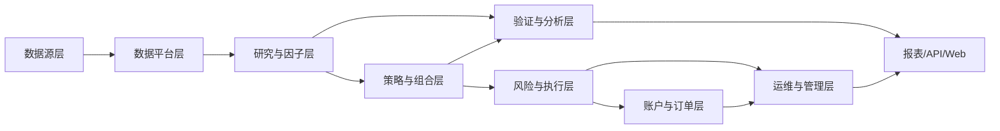

# 股票量化框架系统规划书与需求设计文档

## 1. 文档目标

本文档用于为当前 `stock_quantification` 项目设计一套可持续演进的股票量化框架，目标是把现有的研究、选股、回测、模拟盘和运维能力，升级为一个具备“研究闭环 + 交易闭环 + 运维闭环”的量化平台。

文档重点回答四个问题：

1. 量化系统应该包含哪些管理模块和策略模块
2. 各模块之间如何分层、解耦和协作
3. 每个模块需要满足哪些核心需求
4. 当前项目应该按什么顺序推进建设

本文档同时兼顾三类用途：

- 作为系统规划书，用于统一项目边界、演进目标和建设路线
- 作为需求设计文档，用于指导后续模块拆分和开发排期
- 作为架构蓝图，用于把当前仓库能力映射到未来目标架构

---

## 2. 项目定位

### 2.1 系统定位

本系统定位为一个面向 A 股与美股的中低频股票量化平台，服务于以下场景：

- 因子研究与策略研发
- 股票池筛选与横截面打分
- 组合构建与风险约束
- 历史回测、滚动验证、参数稳定性研究
- 模拟交易与实盘接入
- 运行监控、审计追踪和运维管理

### 2.2 核心设计原则

1. 研究和交易分层
   研究模块负责产出因子、信号、组合和验证结果；交易模块负责下单、成交、持仓和账户同步。

2. 回测、模拟、实盘统一语义
   三种运行模式尽量复用同一套订单、持仓、风控和执行模型，避免策略在不同环境下行为不一致。

3. 数据与策略解耦
   数据底座、因子计算、组合优化、执行路由、风控校验应独立建模，不能把逻辑混在单个脚本里。

4. 全流程可审计
   所有研究结果、运行日志、参数版本、信号和订单都必须可追溯。

5. 先做中低频 long-only，再扩展复杂策略
   当前阶段最适合优先建设多因子选股、指数增强、质量动量、低波防御等可解释、可验证、可落地的策略。

---

## 3. 当前项目现状评估

结合当前仓库代码，系统已经具备以下基础能力：

### 3.1 已有能力

- 统一领域模型
  - `models.py`
  - `interfaces.py`
- 研究流水线
  - `pipeline.py`
  - 已具备股票池筛选、特征计算、alpha 评分、组合目标生成
- 策略预设管理
  - `strategy_catalog.py`
  - 已支持 A 股和美股多个 long-only 策略预设
- 运行引擎
  - `engine.py`
  - `runtime.py`
  - 已覆盖回测、模拟盘、实盘语义抽象
- 回测与验证
  - `backtest.py`
  - `validation.py`
  - 已支持 forward backtest、rolling backtest、walk-forward 和参数稳定性分析
- 报表与产物
  - `reporting.py`
  - `artifacts.py`
  - `result_index.py`
  - 已有文件系统结果索引与统一摘要 schema，可把验证研究、策略套件、滚动回测和本地 paper run 接到同一结果视图
- Web 运维入口
  - `web.py`
  - `ops.py`
  - 已有配置页、日志页、运维中心、状态 API
  - 已能在首页展示研究结果中心和最近一次 paper run 摘要
- 多 Agent 协作雏形
  - `agents.py`

### 3.2 当前短板

虽然已有底座，但距离“完整量化平台”仍有以下缺口：

1. 数据平台不完整
   目前更偏运行时抓取和本地缓存，尚未形成正式的数据仓库、增量更新体系和统一元数据管理。

2. 研究管理不足
   策略、因子、参数、实验、版本之间缺少统一注册、对比和审批流程。

3. 组合管理偏轻
   当前组合构建以规则式为主，尚未形成可配置的约束引擎、优化器和账户级组合管理体系。

4. 执行闭环仍然不完整
   本地 paper 账本已经能稳定记录账户、成交和净值，但券商回报、撤单、成交回写、订单状态机、异常重试仍不完善。

5. 研究与平台治理仍偏轻量
   当前结果索引和工作台已经能支持内部浏览和对比，但还缺正式的研究项目、实验注册、结果筛选、审批与权限体系。

6. 风控体系需要分层
   现在更偏下单前校验，尚未完整覆盖研究风控、组合风控、交易风控和运行风控。

7. 平台治理能力不足
   缺少权限、配置中心、任务编排、资源调度、模型与策略发布治理等平台管理能力。

---

## 4. 目标系统蓝图

### 4.1 总体分层

建议把系统拆成六层：

1. 数据层
   负责行情、财务、基准、行业、公司行为、交易日历、券商回报等数据的采集、清洗、存储和服务。

2. 研究层
   负责因子开发、特征工程、标签构建、样本切分、实验管理、回测分析和验证研究。

3. 策略层
   负责 Alpha 生成、股票池筛选、信号生成、组合构建、风险叠加和调仓计划生成。

4. 执行层
   负责订单生成、交易路由、模拟成交、实盘成交同步、订单状态管理和账户更新。

5. 管理层
   负责策略管理、参数管理、任务管理、配置管理、权限管理、审计管理和运维监控。

6. 展示与服务层
   负责 CLI、Web、API、报表、看板、告警和外部系统集成。

### 4.2 建议架构图



---

## 5. 管理模块设计

管理模块决定系统是否具备“平台化能力”。建议至少建设以下 12 个管理模块。

### 5.1 数据源管理模块

#### 目标

统一管理外部数据源，避免研究和运行代码直接耦合具体接口。

#### 功能需求

- 管理市场数据源、财务数据源、行业分类源、基准源、券商源
- 支持多数据源优先级和回退机制
- 支持数据源健康检查、延迟检测、失败重试
- 支持按市场、资产类型、频率配置数据源
- 支持 source lineage 追踪，记录某字段来自哪个数据源

#### 输出对象

- DataSource
- DataSyncJob
- DataQualityReport

### 5.2 数据仓库与缓存管理模块

#### 目标

为研究和生产提供统一、稳定、可复用的数据底座。

#### 功能需求

- 日线行情库
- 基准指数库
- 财务指标库
- 公司行为库
- 股票主数据和证券元数据
- 历史成分股快照
- 本地缓存、增量更新、断点恢复
- 热数据缓存和冷数据归档
- 数据版本管理和快照能力

#### 建议分层

- ODS：原始抓取层
- DWD：标准化明细层
- DWS：研究服务层
- DM：策略消费层

### 5.3 配置中心模块

#### 目标

统一管理系统级、市场级、策略级和账户级配置。

#### 功能需求

- 环境配置管理：DEV / TEST / PROD
- 市场规则配置：涨跌停、最小交易单位、税费、交易时段
- 策略参数配置：top_n、调仓频率、因子权重、风控阈值
- 账户配置：资金、权限、券商映射、执行方式
- 配置变更审计
- 配置灰度发布和回滚

### 5.4 策略管理模块

#### 目标

对策略进行注册、分组、版本化和生命周期管理。

#### 功能需求

- 策略注册
- 策略分类
- 策略版本管理
- 策略状态管理：草稿、回测中、观察中、生产中、停用
- 策略依赖管理：因子、模型、数据集、执行模型
- 策略适用市场和账户范围管理
- 策略发布审批

#### 推荐元数据

- strategy_id
- strategy_family
- market_scope
- owner
- version
- status
- dependencies
- last_validation_result

### 5.5 因子与模型管理模块

#### 目标

解决因子口径不统一、模型不可追溯的问题。

#### 功能需求

- 因子注册、分类、版本化
- 因子公式和依赖字段管理
- 因子有效性诊断
- 模型训练版本、特征版本、标签版本管理
- 因子淘汰与替换流程
- 因子白名单和黑名单

#### 关键输出

- FactorDefinition
- FactorVersion
- ModelVersion
- FactorDiagnosticReport

### 5.6 研究实验管理模块

#### 目标

把回测、walk-forward、消融研究、参数研究沉淀为可复用实验体系。

#### 功能需求

- 实验任务创建
- 实验输入快照化
- 参数组合批量运行
- 实验结果对比
- 样本内外对比
- Walk-forward 窗口记录
- 参数稳定性评分
- 推荐参数集输出

#### 核心对象

- Experiment
- Scenario
- ValidationRun
- StabilityResult

### 5.7 任务编排与调度管理模块

#### 目标

支撑每日生产扫描、回测任务、数据同步任务和定时风控任务。

#### 功能需求

- 定时调度
- 任务依赖编排
- 单任务锁
- 幂等控制
- 重试与超时控制
- 失败告警
- 任务优先级和资源队列
- 手工补跑和断点续跑

#### 典型任务类型

- 数据同步任务
- 开盘前研究任务
- 调仓信号生成任务
- 盘中风控巡检任务
- 收盘归档与归因任务

### 5.8 账户管理模块

#### 目标

统一管理多账户、账户状态和账户约束。

#### 功能需求

- 账户开户信息
- 账户资金与持仓快照
- 账户策略绑定
- 账户约束配置
- 账户风险等级
- 多账户隔离
- 模拟账户与实盘账户映射

### 5.9 订单与交易管理模块

#### 目标

形成完整的订单生命周期管理能力。

#### 功能需求

- 订单意图生成
- 订单路由
- 订单状态机
- 撤单、改单、重发
- 成交回报同步
- 订单失败原因分类
- 交易流水与对账
- 日终订单归档

#### 推荐状态

- CREATED
- APPROVED
- SUBMITTED
- PARTIALLY_FILLED
- FILLED
- CANCELLED
- REJECTED
- EXPIRED

### 5.10 风控管理模块

#### 目标

把风控从单点校验升级为多层级风险治理体系。

#### 风控分层

1. 研究风控
   防止策略过拟合、样本泄漏、参数漂移。

2. 组合风控
   控制仓位、行业暴露、风格暴露、集中度、流动性风险。

3. 交易风控
   控制单笔金额、参与率、涨跌停、ST、黑名单、可买可卖状态。

4. 运行风控
   控制重复发单、任务重入、数据异常、接口异常、账户异常。

#### 核心功能

- 规则引擎
- 阈值配置
- 多级拦截
- 风险事件记录
- 风险白名单与豁免审批

### 5.11 监控、审计与告警模块

#### 目标

让系统具备可观测性和可追责能力。

#### 功能需求

- 服务健康检查
- 数据同步监控
- 任务运行监控
- 交易异常监控
- 风险事件监控
- 用户操作审计
- 策略发布审计
- 告警通知

#### 监控维度

- 系统健康
- 数据完整性
- 策略收益偏离
- 订单失败率
- 账户净值波动异常

### 5.12 权限与组织管理模块

#### 目标

在团队协作场景下控制数据、策略和交易权限。

#### 功能需求

- 用户与角色管理
- 菜单和功能权限
- 策略编辑权限
- 账户交易权限
- 生产发布审批权限
- 审计查看权限

#### 推荐角色

- 研究员
- 策略负责人
- 风控负责人
- 交易运营
- 系统管理员

---

## 6. 策略模块设计

策略模块是量化框架的核心竞争力。建议采用“研究流水线 + 策略流水线 + 执行流水线”的组合设计。

### 6.1 策略模块总分层

1. Universe 模块
2. Feature / Factor 模块
3. Alpha Scoring 模块
4. Signal Generation 模块
5. Portfolio Construction 模块
6. Risk Overlay 模块
7. Rebalance Planning 模块
8. Execution Modeling 模块
9. Attribution & Diagnostics 模块

### 6.2 股票池管理模块

#### 职责

- 定义可投资范围
- 过滤停牌、ST、新股、低流动性、低价格股票
- 支持指数成分股、自定义股票池、全市场股票池

#### 输入

- 市场
- 日期
- 股票主数据
- 流动性与状态信息

#### 输出

- UniverseSelection
- RejectionReasons

### 6.3 特征与因子计算模块

#### 职责

对股票池内标的计算策略所需特征和因子。

#### 量化深度增强（专家建议）

- **风格与行业中性化 (Neutralization)**
  - 支持按行业（Sector/Industry）进行因子 Z-Score 标准化。
  - 支持市值（Size）中性化，消除小市值溢价导致的无意识暴露。
- **因子收益归因 (Factor Attribution)**
  - 计算因子 IC (Information Coefficient) 和 Rank IC。
  - 计算因子收益率贡献，识别因子在不同市场环境下的有效性。

#### 当前适合优先建设的因子组

- 动量因子
  - 20 日相对强度
  - 60 日相对强度
  - 趋势强度
- 质量因子
  - ROE / ROA / 毛利率稳定性
  - 盈利能力
  - 经营质量
- 风险因子
  - 波动率
  - 最大回撤
  - Beta
- 流动性因子
  - 成交额
  - 换手率
  - 容量约束
- 价值因子
  - PE / PB / EV/EBITDA / FCF Yield
  - 建议作为下一阶段扩展

#### 输出

- FeatureRow
- FactorSnapshot
- FactorDiagnostics

### 6.4 Alpha 评分模块

#### 职责

把多维因子合成为最终横截面评分。

#### 设计方式

- 标准化
- 去极值
- 缺失值处理
- 行业中性或市值中性
- 加权合成
- 约束评分下限

#### 输出

- AlphaScore
- FactorContribution

### 6.5 信号生成模块

#### 职责

将 Alpha 排名转化为可执行的买卖信号。

#### 功能需求

- Top-N 选股
- 持仓替换逻辑
- 最小调仓阈值
- 调仓缓冲区
- 买入和卖出原因解释
- 信号有效期管理

#### 输出

- SignalSnapshot
- RecommendedList

### 6.6 组合构建模块

#### 职责

根据信号生成目标持仓。

#### 功能需求

- 等权组合
- 风险预算组合
- 基准增强组合
- 行业权重约束
- 单票权重上限
- 现金缓冲
- 换手率控制

#### 建议支持的组合方法

- Equal Weight
- Score Weight
- Benchmark Blend
- Risk Parity Lite
- Optimizer Based

#### 输出

- PortfolioPlan
- TargetPosition
- PortfolioDiagnostics

### 6.7 风险叠加模块

#### 职责

在组合构建后增加额外的风险覆盖。

#### 控制维度

- 单票集中度
- 行业集中度
- 风格暴露
- Beta 暴露
- 流动性暴露
- 黑名单过滤
- 事件风险过滤

#### 输出

- RiskCheckResult
- AdjustedTargets

### 6.8 调仓计划模块

#### 职责

把目标持仓转化为账户维度的调仓建议和订单意图。

#### 功能需求

- 当前持仓与目标持仓差分
- 现金检查
- 最小交易单位调整
- 碎股处理
- 账户级可买可卖校验
- 分账户下单建议

#### 输出

- TradeSuggestion
- OrderIntent

### 6.9 成交与执行建模模块

#### 职责

在回测、模拟和实盘环境下统一处理滑点、费用和成交能力。

#### 功能需求

- 价格锚点
- 滑点估计
- 税费估计
- 参与率限制
- 部分成交模拟
- 成交回写

#### 输出

- ExecutionQuote
- ExecutionFill
- ExecutionResult

### 6.10 回测与验证模块

#### 职责

验证策略是否可持续、可迁移、可生产。

#### 必备能力

- 单期 forward backtest
- 滚动回测
- train / validate / test 切分
- walk-forward
- 参数稳定性研究
- 因子消融研究
- 收益归因
- 成本拖累分析

#### 核心输出

- BacktestReport
- RollingBacktestReport
- WalkForwardReport
- ParameterStabilityReport

### 6.11 归因与诊断模块

#### 职责

解释策略为什么赚钱、为什么失效、风险来自哪里。

#### 功能需求

- 风格归因
- 行业归因
- 因子贡献归因
- 收益分解
- 成本拖累归因
- 胜率与赔率拆解
- 高回撤区间分析
- 异常日期复盘

### 6.12 策略族管理建议

结合当前项目和股票量化通用路径，建议把策略分为以下几类：

#### 第一优先级

- 指数增强
- 质量动量
- 中期动量
- 低波防御
- 流动性龙头

#### 第二优先级

- 价值增强
- 行业轮动
- 事件驱动
- 机器学习排序

#### 第三优先级

- 市场中性
- 统计套利
- CTA / 多资产趋势

---

## 7. 关键业务流程设计

### 7.1 研究流程

1. 选择市场、策略和样本区间
2. 装载股票池和历史数据
3. 计算因子和特征
4. 生成 Alpha 排名
5. 构建组合
6. 运行回测和验证
7. 输出报表与稳定性结论
8. 决定是否进入观察或生产

### 7.2 每日生产流程

1. 日初同步最新数据
2. 校验数据完整性和交易日状态
3. 运行策略生成目标持仓
4. 运行组合风控和交易风控
5. 生成调仓建议
6. 人工审批或自动路由
7. 提交订单并跟踪成交
8. 更新账户状态与运行产物
9. 生成日终报告和监控告警

### 7.3 策略发布流程

1. 策略研发完成
2. 完成回测与样本外验证
3. 输出研究结论与风险说明
4. 进入观察名单
5. 绑定模拟账户运行
6. 达到上线标准后发起审批
7. 发布到生产账户
8. 持续监控收益偏离与风险事件

---

## 8. 核心数据对象设计

建议在当前领域模型基础上统一以下核心实体。

### 8.1 主数据对象

- Instrument
- Benchmark
- SectorClassification
- TradingCalendar
- CorporateAction

### 8.2 研究对象

- UniverseSelection
- FeatureRow
- FactorSnapshot
- AlphaScore
- Experiment
- Scenario
- ValidationReport

### 8.3 组合与交易对象

- SignalSnapshot
- PortfolioPlan
- TargetPosition
- TradeSuggestion
- OrderIntent
- BrokerOrder
- ExecutionFill
- AccountState
- Position

### 8.4 管理对象

- StrategyDefinition
- StrategyVersion
- FactorDefinition
- DataSource
- JobRun
- AuditEvent
- AlertEvent
- ConfigItem

---

## 9. 详细需求设计

下面按需求类别给出建议的详细设计。

### 9.1 功能性需求

#### FR-01 数据接入

- 系统应支持 A 股和美股日线行情接入
- 系统应支持基准指数历史数据接入
- 系统应支持基础财务指标接入
- 系统应支持公司行为数据接入
- 系统应支持按市场增量更新

#### FR-02 股票池筛选

- 系统应支持全市场和自定义股票池
- 系统应支持按停牌、ST、上市天数、价格、流动性过滤
- 系统应记录每只股票被剔除的原因

#### FR-03 因子与特征

- 系统应支持多因子批量计算
- 系统应支持因子标准化和合成评分
- 系统应支持因子分组与版本管理
- 系统应支持因子诊断报表输出

#### FR-04 策略生成

- 系统应支持根据信号生成目标持仓
- 系统应支持可配置的组合约束
- 系统应支持多市场策略预设
- 系统应支持策略参数覆盖与策略版本冻结

#### FR-05 回测验证

- 系统应支持单次回测和滚动回测
- 系统应支持 train / validate / test 切分
- 系统应支持 walk-forward
- 系统应支持参数稳定性比较
- 系统应支持回测结果持久化

#### FR-06 模拟盘与实盘执行

- 系统应支持 advisory 与 auto 两种执行模式
- 系统应支持模拟盘账户维护
- 系统应支持实盘券商适配接口
- 系统应支持订单状态回写和成交同步

#### FR-07 风控

- 系统应支持下单前风控校验
- 系统应支持组合层集中度和暴露控制
- 系统应支持交易黑名单与禁买禁卖列表
- 系统应支持风险事件审计

#### FR-08 管理与运维

- 系统应支持项目配置维护
- 系统应支持任务日志和运行状态查看
- 系统应支持运维中心查看健康状态和后台任务
- 系统应支持任务锁和重复触发保护

### 9.2 非功能性需求

#### NFR-01 可扩展性

- 新市场接入不应大规模改动核心策略逻辑
- 新策略应通过注册机制接入
- 新券商应通过 BrokerAdapter 接口接入

#### NFR-02 可追溯性

- 每次研究和运行必须保留 artifact
- 每次策略运行必须记录输入参数和运行上下文
- 每次订单变更必须可审计

#### NFR-03 可用性

- 核心状态页必须可返回健康状态
- 关键任务必须具备重试和告警机制
- 重复运行必须具备幂等保护

#### NFR-04 性能

- 单市场日线全市场扫描应支持分钟级完成
- 常规回测任务应支持并行化扩展
- 报表输出不应阻塞核心调度链路

#### NFR-05 安全性

- 凭证不落库明文
- 生产账户权限最小化
- 生产发布必须具备审批链路

---

## 10. 模块优先级与建设顺序

建议按 P0、P1、P2 三层推进。

### 10.1 P0：当前必须补齐

- 数据仓库与增量同步
- 策略管理
- 因子管理
- 实验管理
- 组合风控
- 订单状态机
- 审计与告警
- 配置中心

### 10.2 P1：进入平台化阶段后建设

- 账户中心
- 多账户调仓与资金分配
- 策略发布审批
- 因子归因与收益归因中心
- 任务编排与资源调度
- 券商回报同步和对账

### 10.3 P2：中长期建设

- 机器学习特征仓
- 模型训练平台
- 多资产支持
- 市场中性和对冲策略框架
- 事件驱动与另类数据平台

---

## 11. 建议的目标目录结构

结合当前仓库，建议未来逐步演进为以下目录结构：

```text
src/stock_quantification/
  core/
    models/
    interfaces/
    enums/
  data/
    providers/
    warehouse/
    cache/
    sync/
    quality/
  research/
    universe/
    factors/
    features/
    experiments/
    validation/
    diagnostics/
  strategy/
    presets/
    alpha/
    signals/
    portfolio/
    overlays/
    rebalance/
  execution/
    planner/
    broker/
    runtime/
    orderbook/
    reconciliation/
  risk/
    research/
    portfolio/
    trading/
    runtime/
  platform/
    config/
    ops/
    audit/
    scheduler/
    auth/
  service/
    cli/
    web/
    api/
  reporting/
    artifacts/
    markdown/
    dashboard/
```

---

## 12. 与当前代码的映射建议

为了避免“大改重写”，建议采用渐进式映射。

### 12.1 可以保留并继续增强的模块

- `models.py`
  继续作为领域对象基础
- `interfaces.py`
  继续作为核心抽象接口层
- `pipeline.py`
  继续作为研究流水线核心
- `strategy_catalog.py`
  升级为策略注册中心雏形
- `runtime.py`
  继续承担统一执行语义
- `backtest.py`
  继续承担回测和验证入口
- `validation.py`
  继续承担样本外验证和稳定性研究
- `web.py`
  继续作为平台控制台入口
- `ops.py`
  升级为运维状态与任务管理基础模块

### 12.2 建议新增的关键模块

- `data_registry.py`
- `factor_registry.py`
- `strategy_registry.py`
- `experiment_manager.py`
- `config_center.py`
- `order_lifecycle.py`
- `risk_rules.py`
- `alerting.py`
- `scheduler.py`
- `reconciliation.py`

---

## 13. 上线标准建议

一个策略从研究到生产，建议满足以下标准：

### 13.1 研究上线门槛

- 样本外收益为正
- 相对基准超额收益为正
- Walk-forward 多窗口结果稳定
- 参数稳定性不低于预设阈值
- 回撤和换手符合账户约束

### 13.2 模拟盘上线门槛

- 连续一段观察期运行稳定
- 信号与订单链路完整
- 无重大数据缺失
- 无重复发单和明显异常成交

### 13.3 生产上线门槛

- 已完成风险评审
- 已完成券商接口验证
- 已完成异常回滚预案
- 已配置监控和告警

---

## 14. 分阶段实施路线图

### 第一阶段：量化研究底座完善

目标：把当前项目从“可运行”升级到“可稳定研究”。

建设内容：

- 建立本地日线数据仓库
- 因子注册和版本管理
- 策略注册和版本管理
- 研究实验管理
- 因子诊断和归因报表
- 回测与验证标准化输出

### 第二阶段：交易闭环完善

目标：把当前项目从“有建议”升级到“有交易闭环”。

建设内容：

- 订单状态机
- 成交回报同步
- 撤单和补单机制
- 账户同步与对账
- 交易风控和运行风控

### 第三阶段：平台治理完善

目标：把当前项目从“个人底座”升级到“团队平台”。

建设内容：

- 配置中心
- 调度中心
- 权限中心
- 审计中心
- 告警中心
- 发布审批流

### 第四阶段：高级策略扩展

目标：把系统从单一多因子 long-only 扩展到更高阶策略体系。

建设内容：

- 价值增强
- 事件驱动
- 机器学习排序
- 多资产支持
- 市场中性与对冲框架

---

## 15. 结论

从当前仓库基础看，这个项目已经具备量化框架最难得的一部分：统一模型、研究流水线、回测验证、模拟盘语义和 Web 运维入口。下一步不建议推倒重来，而应该围绕“平台治理”和“交易闭环”继续增强。

如果把系统拆成一句话，建议的目标架构是：

“以数据平台为底座，以研究验证为核心，以组合风控为中枢，以订单执行为闭环，以配置、审计、调度、监控为治理外壳的中低频股票量化平台。”

对当前项目最关键的建设顺序是：

1. 先补数据仓库、策略/因子/实验管理
2. 再补组合风控、订单状态机、成交回写
3. 再补调度、审计、告警、权限和发布治理
4. 最后扩展价值、事件、机器学习和多资产能力

这条路线能最大化复用现有工程，并让系统从“能跑”逐步进化为“能研究、能交易、能治理、能扩展”。
