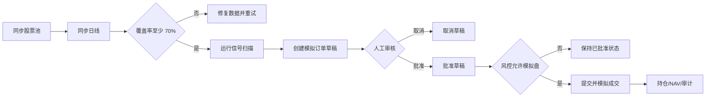

# EvoQuant 产品需求文档（PRD）

## 1. 产品背景与目标

EvoQuant 是面向美股和 A 股日线研究的量化研究及模拟交易平台。它把股票池和行情同步、横截面动量信号、回测、候选参数生成、模拟订单草稿、人工审批、风控和审计放在一个管理台中，帮助研究人员重复执行并追溯研究流程。

当前版本是研究与模拟盘 MVP。系统没有券商或交易所接入，不提供真实下单，也不把信号当作投资建议。业务核心边界是：系统可以自动同步和生成研究草稿，但草稿必须由用户明确批准并提交后才会形成模拟成交。

## 2. 用户角色

| 角色 | 主要目标 | 当前权限模型 |
|---|---|---|
| 量化研究员 | 管理策略、扫描信号、回测和生成候选参数 | 单一可信管理端，无登录和角色隔离 |
| 模拟盘操作员 | 创建账户、检查草稿、批准/取消/提交 | 与研究员共享管理端 |
| 风控/审计人员 | 暂停模拟交易、查看状态和审计事件 | 与研究员共享管理端 |
| 运维人员 | 配置数据库、行情源、定时任务与部署 | 通过环境变量、Compose 和 API 操作 |

身份认证、细粒度授权和多租户不在当前范围。

## 3. 产品范围

### 3.1 已实现

- 市场领域模型支持 `US`、`CN`、`CRYPTO`；实际股票池、行情同步、定时同步和信号流程仅支持 `US`、`CN`。
- 美股使用 Yahoo Finance；配置 `TIINGO_API_KEY` 或 `EVOQUANT_US_PROVIDER=tiingo` 后使用 Tiingo 日线。A 股使用 BaoStock。CSV Provider 供离线与测试使用。
- PostgreSQL 保存股票池、日线、同步任务、质量报告、策略、扫描结果、草稿、模拟账户/订单/成交/持仓、风险状态、计划配置及审计事件。
- 唯一可执行信号模板为 `cross_sectional_momentum`。它使用长短周期收益排名，扣除波动率和最大回撤排名；参数可覆盖周期、Top N、退出排名、权重和风险阈值。
- 市场数据覆盖率低于 70% 时扫描失败。结果包含 `buy`、`hold`、`sell`、目标权重、原因和风险标志。
- 支持直接净值序列回测，以及基于缓存日线的信号回测。
- 支持策略注册、指标记录和状态修改；支持按参数空间笛卡尔积生成有限数量候选。
- 支持模拟账户、订单、即时简化成交、持仓及按给定价格重估净值。
- 支持从信号创建草稿，按 `draft → approved → submitted` 执行，或取消；定时任务只创建草稿，保留人工审批。
- 风控模式为 `research-only`、`paper-only`、`paused`，`paused` 阻止模拟订单提交；真实交易始终关闭。

### 3.2 明确不在当前版本

- 真实交易、券商接入、实时/分钟行情、订单簿和生产级撮合。
- 用户登录、RBAC、租户隔离、密钥管理 UI。
- Redis、消息队列、独立 Worker、高可用和多副本调度。
- 遗传算法、自动回测筛选、自动晋级或自动上线。Evolution 当前只枚举候选参数。
- 交易日历、公司行动、完整复权验证和数据源 SLA。
- 模拟盘草稿尚未持久化买入日期，因此没有执行 A 股 T+1；只有信号回测使用内存中的买入日期执行 T+1。模拟成交费用当前为 0。
- 数据库外键、检查约束、连接池、自动版本化迁移。

## 4. 功能模块与验收要求

| 模块 | 用户能力 | 关键规则/验收 |
|---|---|---|
| Overview | 查看策略数、模拟账户/NAV、审计数和风险状态 | 后端不可用时显示明确错误 |
| Stock Pool | 按市场查看标的及行情覆盖 | US/CN 可同步；A 股过滤 B 股 |
| Data Sources | 同步股票池、创建/重试 K 线任务、切换计划 | 同步任务可追踪进度和失败标的；CRYPTO 计划返回 400 |
| Strategies | 创建策略、查看指标、修改状态 | 状态变更记录原因和审计事件 |
| Signals | 扫描 US/CN，查看排名和生成草稿 | 仅支持已实现模板；覆盖率不足或参数无效返回 400 |
| Backtests | 运行净值回测或缓存行情回测 | 输入错误返回 400；结果包含绩效指标 |
| Evolution | 输入参数空间并生成候选 | 候选是笛卡尔积截断，不宣称自动优化 |
| Paper Trading | 管理账户、订单、成交、持仓和草稿 | 草稿必须先批准；暂停模式禁止提交；不允许重复成交或净空头 |
| Risk | 切换研究、模拟和暂停模式 | `live_enabled=true` 永远拒绝 |
| Audit Log | 查看策略、风险、扫描、草稿和模拟盘事件 | 事件按创建时间返回 |

## 5. 核心用户用例

### UC-01 初始化研究数据

用户先在 Stock Pool 同步 US 或 CN 股票池，再在 Data Sources 创建初始 K 线任务。后台按批次获取近五年日线并记录进度；部分失败时，用户仅重试失败标的。

### UC-02 生成并审核信号草稿

用户创建模拟账户，完成行情同步后在 Signals 运行扫描。覆盖率满足要求时查看排名和风险标记，选择买卖信号生成草稿。操作员在 Paper Trading 检查数量、价格、原因和风险标记后批准，再显式提交；提交形成简化模拟成交和持仓。

### UC-03 暂停模拟交易

风控人员将模式改为 `paused` 并填写原因。系统记录审计事件，之后直接模拟订单及已批准草稿均不得提交。恢复到 `paper-only` 后可继续操作。

### UC-04 研究策略与回测

研究员创建策略，从净值序列计算指标，或对缓存日线运行信号回测。研究员可生成参数候选并人工登记为研究策略；系统不会根据结果自动晋级。

## 6. 业务流程

定时器在 US/CN 配置的收盘后时间检查增量同步。已有历史行情时才创建增量任务；成功或部分成功后运行信号并生成草稿，仍停在人工审核环节。

## 7. 非功能要求与限制

- 安全：仓库和生成文档不得包含真实数据库凭据；测试只有显式设置 `EVOQUANT_TEST_DB_URL` 才连接数据库，并为每个测试使用临时 schema。
- 可追溯：重要策略、风险、扫描、草稿及模拟交易动作写入 `audit_events`。
- 一致性：API 以 `docs/openapi.json` 为机器可读基线，数据库以 `docs/sql/初始化.sql` 和代码 DDL 为基线。
- 性能：大股票池查询按 500 个 symbol 分块；后台任务仍运行于 API 进程，没有独立队列和任务锁。
- 精度：金额、价格和数量当前使用双精度浮点；正式资金系统需要迁移为定点数。
- 行情：外部免费数据可能限流、延迟或改变字段；当前 Provider 未可靠填充所有停牌和涨跌停标志。
